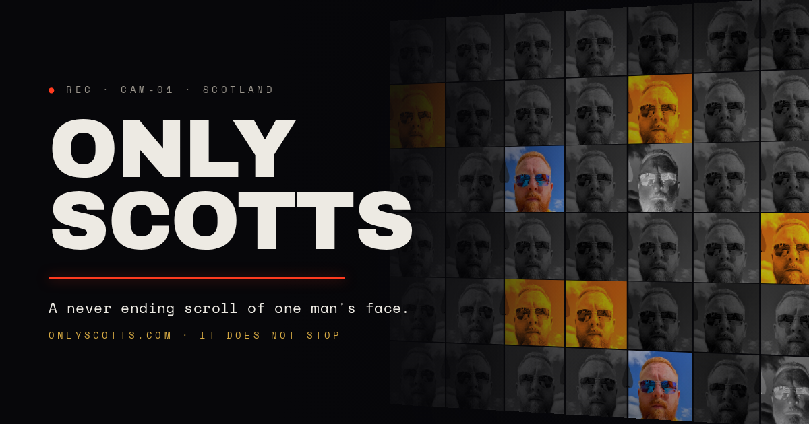

[Only Scotts](https://onlyscotts.com) is a website with one subject. Open it
and you get a wall of my face - the same photo, tiled edge to edge - and as you
scroll it keeps going. **It does not stop.** That is the whole website.

It started as a joke gallery where other Scotts could submit their photos. It
grew an approval queue, a certificate generator, a Wall of Shame, a fake
operating system and a Keith problem. Then it went back to basics: one face,
three pages, everything else archived.

## What it does

- `/` - an infinite grid of one photo, each tile re-filtered so a single image
  fills a wall. A giant **SCOTT** is punched through the faces and a counter
  tallies how many you've rendered
- Most tiles are dimmed to greyscale so the wall reads as texture; a rare few
  come up full colour, orange-toned or inverted - loud enough to feel like a
  fault rather than a pattern
- Hover a tile and it snaps back to the real photo; now and then one glitches
  into a hue-shifted negative
- `/aboutscott` - the subject's file: species *Homo Scotticus (verified)*,
  two unimpressed dogs, Keith tolerance **0.000%**
- `/contact` - how to reach him, should you need to

## The archive

Nothing was deleted when the site slimmed down. Every page it grew is still up,
at its original URL, just out of the sitemap, marked `noindex` and reachable
only from an unlisted `/archive` you have to type yourself.

| Page | What it is |
|------|------------|
| `/identificationmanual` | How to identify a Scott in the wild |
| `/submit` | The upload desk - closed, paperwork left on display |
| `/certificate` | Redeem a claim code for a Certificate of Scotthenticity |
| `/imposters` | The Wall of Shame |
| `/keiths` | The Keith Hall of Shame |
| `/testimonials` | Sworn statements from the ascended |
| `/helloworld` | A fake OS boot sequence with a mini-game and 18 achievements |
| `/construct` | The Construct (also at `construct.onlyscotts.com`) |

## How it works

The live site is plain HTML, CSS and JavaScript on **Azure Static Web Apps**.
The home page doesn't call an API at all: it reads a short list of photos from
the page itself, and an infinite-scroll loop keeps appending tiles, each with a
random filter, flip and scale.

The archived submission flow is where the backend lives - a **.NET 8 Azure
Functions** API (isolated worker) behind SWA's built-in routing.

| Piece | Role |
|-------|------|
| Static frontend | The wall, the subject file, contact, and the archive |
| .NET 8 Azure Functions | Submissions, approvals, certificates, health checks |
| Azure Blob Storage | The submitted images |
| Azure Table Storage | Submission metadata and review state |
| Entra ID (SWA auth) | Guards `/admin`, `/manage` and `/health` behind an `admin` role |

Locally it all runs under Docker Compose - nginx for the frontend, the Functions
host, and Azurite standing in for Azure Storage - with auth mocked so the admin
pages work without a real sign-in.

## Why

Because someone had to, and it was always going to be me. Built, like most
things around here, by strongarming an AI into writing HTML under duress.
