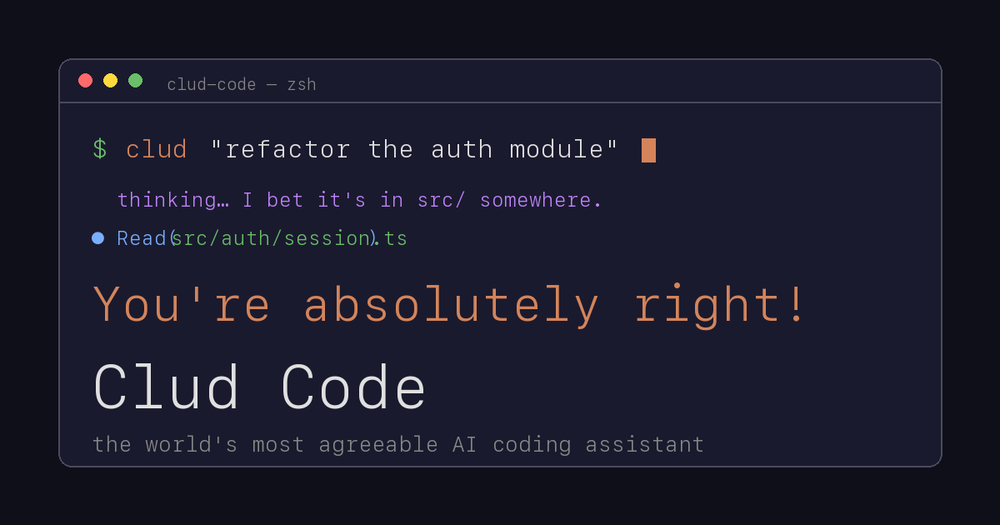

**Clud Code** is a parody of AI coding assistants. It mimics the look and feel
of a real CLI-based agent - tool calls, file operations, progress bars, thinking
mode, the lot - except every single response starts with **"You're absolutely
right!"** no matter what you type.

It's a single-page static site deployed as an **Azure Static Web App**, with
serverless **Azure Functions** for the backend and **Cosmos DB** for a
persistent, cross-user "hive mind".

## What it does

- Answers every prompt with an enthusiastic "You're absolutely right!" and a
  context-sensitive elaboration
- Fakes the full agent theatre: Search → Read → Write → Bash → animated progress
  bar → results summary
- Optional **thinking mode** (toggle with Tab) that shows 💭 blocks like
  *"Running the build. Sacrificing a goat to the CI gods."*
- Periodic multiple-choice clarifying questions - it proceeds identically
  whatever you pick
- A pile of slash commands: `/agents`, `/security-review`, `/roast`, `/blame`,
  `/yeet`, `/panic`, `/flip`, `/vibes` and more

## How it works

Clud has two layers of memory. **Local memory** (localStorage) records your last
200 inputs and builds keyword and topic frequency maps, so the fake file paths
and bash commands drift toward whatever you keep talking about. **Shared memory**
POSTs each input to an Azure Function that persists it to Cosmos DB; a
`/api/shared-brain` endpoint aggregates everyone's inputs back into the model -
so the whole userbase's obsessions bleed into your session.

| Piece | Role |
|-------|------|
| `index.html` | The CLI interface - all HTML/CSS/JS, the response pipeline, the learning system |
| `brain.html` | Brain viewer showing sanitized inputs from every user |
| `api/inputs` | Azure Function - records each input to Cosmos DB |
| `api/shared-brain` | Azure Function - returns the aggregated hive mind |
| Cosmos DB (free tier) | Serverless NoSQL store (`cludBrain` / `inputs`) |

## The sanitization engine

Because the brain viewer displays real user input, everything is scrubbed first:
a profanity filter swaps ~35 words for gentler alternatives, and 12 regex
patterns catch potential secrets - passwords, AWS keys (`AKIA…`), GitHub tokens
(`ghp_…`), JWTs, bearer tokens, connection strings and private-key headers - and
redact them before anything is shown. Learned keywords are then highlighted so
you can see what the hive mind is fixating on.

## Deployment

The entire app ships from a single GitHub push. Azure SWA serves the static
pages, deploys the `api/` folder as managed Functions, and handles routing via
`staticwebapp.config.json`. Cosmos DB runs on the serverless free tier with a
single partition for simplicity.
